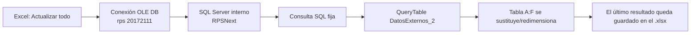

# Visitas COT — descubrimiento del Excel y propuesta de integración

Fecha: 2026-07-30  
Estado: aprobado; implementación en curso

## Objetivo

Reconstruir qué hace `COT con planning.xlsx` al pulsar **Actualizar datos**,
identificar su fuente y reglas, y decidir si conviene sustituirlo por una web
nueva o integrarlo en CoordinaOT.

El análisis del libro es estático y reproducible sobre el fichero recibido. Se
ha añadido una validación agregada de solo lectura contra RPS, sin extraer
nombres, textos ni credenciales. No se ha modificado el Excel.

## Evidencia del libro

- Fichero: `C:\Users\ivan.sanchez\Downloads\COT con planning.xlsx`
- SHA-256:
  `BA2A68AABC676A1248910E5003DA0BDE3165B213960E0A6C0C20B0E599B39D7C`
- Tamaño: 11.473 bytes.
- Una hoja: `Hoja1`.
- Un rango usado: `A1:F2`.
- Una tabla externa: `Tabla_DatosExternos_2`.
- Una conexión: `rps 20172111`.
- No hay VBA (`vbaProject.bin`), macros, Power Query, fórmulas, tablas
  dinámicas ni vínculos a otros libros.
- El libro guarda el último resultado (`saveData=1`); por eso puede abrirse y
  mostrar datos aunque RPS no esté accesible.
- El libro no declara refresco al abrir ni intervalo periódico. La actualización
  es manual mediante **Actualizar datos / Actualizar todo**.

La fila cacheada en la copia analizada es un único aviso COT, grabado el
2026-06-22, con un pedido y una planificación fechada el 2026-06-25. Es una
fotografía del último refresco, no una tabla mantenida por Excel.

## Qué ocurre al pulsar “Actualizar datos”



Propiedades relevantes de la conexión:

| Propiedad | Valor / efecto |
|---|---|
| Tipo | OLE DB (`type=5`) |
| Proveedor | `SQLOLEDB.1` (legado) |
| Base de datos | `RPSNext` |
| Usuario | cuenta SQL de solo lectura |
| Ejecución | en segundo plano (`background=1`) |
| Conexión viva | sí (`keepAlive=1`) |
| Resultado cacheado | sí (`saveData=1`) |
| Contraseña guardada | sí (`savePassword=1`) |
| Cifrado de transporte | desactivado en la cadena recibida |

La contraseña se ha omitido deliberadamente de este documento.

## Consulta SQL extraída

Se ha normalizado el XML de Excel a SQL legible, sin cambiar la lógica:

```sql
SELECT
  w.MaintenanceWarningCode AS Incidencia,
  ord.CodOrder AS pedido,
  w.EntryDate AS FechaGrabacion,
  w.Description AS Texto,
  (
    SELECT emp.Description + ' - ' + CONVERT(varchar, om.ExecutionDate, 103)
    FROM MANMaintenanceOrder om
    INNER JOIN GENEmployee emp
      ON emp.IDEmployee = om.IDResponsible
    WHERE om.CodCompany = '001'
      AND om.IDMaintenanceWarning = w.IDMaintenanceWarning
      AND om.IDMaintenanceOrderStatus = '001-0'
  ) AS Planing,
  (
    SELECT TOP 1
      sol.Descripcion + ' - ' + emp.Description + ' - '
      + CONVERT(varchar, om.ExecutionDate, 103) + ' - '
      + CASE
          WHEN ISNULL(om.Notes, 'nulo') = 'nulo' THEN ''
          ELSE om.Notes
        END
    FROM MANMaintenanceOrder om
    INNER JOIN GENEmployee emp
      ON emp.IDEmployee = om.IDResponsible
    INNER JOIN _MANMaintenanceOrder_Custom om_ct
      ON om.IDMaintenanceOrder = om_ct.IDMaintenanceOrder
    INNER JOIN tgm_soluciones_sat sol
      ON om_ct.IDSolucionSAT = sol.IDSolucionSAT
    WHERE om.CodCompany = '001'
      AND om.IDMaintenanceWarning = w.IDMaintenanceWarning
      AND om.IDMaintenanceOrderStatus <> '001-0'
    ORDER BY om.ExecutionDate DESC
  ) AS UltimaOM
FROM MANMaintenenceWarningType t
INNER JOIN MANMaintenanceWarning w
  ON w.IDMaintenanceWarningType = t.IDMaintenanceWarningType
LEFT JOIN _CPRMOTask_Custom mocust
  ON mocust.IDMaintenanceWarning = w.IDMaintenanceWarning
 AND ISNULL(mocust.IDMaintenanceWarning, 'nulo') <> 'nulo'
LEFT JOIN CPRMOTask task
  ON task.IDMOTask = mocust.IDMOTask
LEFT JOIN CPRManufacturingOrder mo
  ON task.IDManufacturingOrder = mo.IDManufacturingOrder
LEFT JOIN FACOrderLineSL ol
  ON ol.IDManufacturingOrder = mo.IDManufacturingOrder
LEFT JOIN FACOrderSL ord
  ON ord.IDOrder = ol.IDOrder
WHERE t.CodMaintenanceWarningType = 'COT'
  AND t.CodCompany = '001'
  AND (
    SELECT COUNT(*)
    FROM MANMaintenanceOrder om
    INNER JOIN GENEmployee emp
      ON emp.IDEmployee = om.IDResponsible
    WHERE om.CodCompany = '001'
      AND om.IDMaintenanceWarning = w.IDMaintenanceWarning
      AND om.IDMaintenanceOrderStatus = '001-0'
  ) > 0;
```

## Significado funcional de cada columna

| Excel | Origen | Regla |
|---|---|---|
| `Incidencia` | `MANMaintenanceWarning.MaintenanceWarningCode` | Código del aviso de tipo COT |
| `pedido` | `FACOrderSL.CodOrder` | Pedido enlazado por aviso → tarea → OF → línea de venta |
| `FechaGrabacion` | `MANMaintenanceWarning.EntryDate` | Alta del aviso, no fecha de la visita |
| `Texto` | `MANMaintenanceWarning.Description` | Texto libre del aviso |
| `Planing` | orden de mantenimiento abierta | Responsable + `ExecutionDate`, concatenados |
| `UltimaOM` | última orden no abierta | Solución + responsable + fecha + notas |

Una fila aparece si:

1. el aviso pertenece al tipo `COT`;
2. pertenece a la empresa `001`;
3. tiene al menos una orden de mantenimiento con estado `001-0` (descripción
   oficial del catálogo de RPS: **Creado**).

La consulta no filtra por fecha presente/futura. Por tanto, “programada” en este
Excel significa realmente “tiene una orden en estado Creado”, aunque su fecha
ya haya pasado.

## Validación agregada en RPS (2026-07-30)

Se ejecutó una consulta independiente de solo lectura para comprobar
cardinalidad y riesgo, sin devolver filas de negocio:

| Métrica | Resultado |
|---|---:|
| Avisos COT con orden `001-0` | 4 |
| Órdenes/visitas `001-0` | 4 |
| Avisos con más de una orden `001-0` | 0 |
| Máximo de órdenes `001-0` por aviso | 1 |
| Avisos atrasados | 0 |
| Avisos para hoy | 0 |
| Avisos futuros | 4 |
| Avisos que el encadenado de joins duplicaría | 0 |
| Avisos enlazados a varios pedidos | 0 |
| Tiempo de consulta agregada | 118–196 ms |

Conclusión: los riesgos de cardinalidad no se materializan en la fotografía
actual, pero la SQL no los impide y deben resolverse en el diseño web.

## Problemas detectados en la consulta original

1. **Credencial distribuida dentro del Excel.** Cualquier copia contiene una
   contraseña SQL recuperable. Debe rotarse la contraseña de esa cuenta y
   dejar de distribuir esta versión.
2. **Transporte sin cifrar.** La cadena declara `Use Encryption for Data=False`.
3. **Fallo si hay varias planificaciones abiertas.** La subconsulta `Planing`
   es escalar pero no usa `TOP 1`; dos órdenes `001-0` provocarían
   `Subquery returned more than 1 value`.
4. **Duplicados posibles.** Los `LEFT JOIN` aviso → tarea → OF → pedido pueden
   producir varias filas para el mismo aviso si hay más de un enlace.
5. **Pedido no determinista.** No hay una regla explícita para elegir pedido
   cuando existen varios.
6. **Orden visual no estable.** La consulta final no tiene `ORDER BY`.
7. **Datos mezclados en texto.** Responsable, fecha, solución y notas llegan
   concatenados; esto impide filtrar, ordenar y agrupar correctamente.
8. **Código de estado mágico.** `001-0` se usa como equivalente a visita
   pendiente y RPS lo denomina **Creado**. La web lo hará explícito y separará
   `Creado` de `Cerrado`.
9. **Sin control de errores ni observabilidad.** Si RPS o la VPN fallan, Excel
   conserva datos viejos sin indicar con claridad su antigüedad.

## Recomendación

Integrar **Visitas COT dentro de `coordina-ot`**, con capa de datos y pantalla
propias. No crear otro repositorio en la primera versión.

Motivos:

- mismo SQL Server y misma base `RPSNext`;
- CoordinaOT ya tiene pool `mssql` server-only y variables de entorno;
- ya existe despliegue en red interna/VPN, manejo de errores, mock y tests;
- los usuarios y el contexto de pedidos/OF son cercanos;
- se evita otra app que desplegar, vigilar y mantener.

La pantalla debe ser autónoma: `GET /api/visitas-cot` + un componente
`VisitasCotView`. Puede aparecer como una quinta opción de navegación, pero no
debe mezclarse con la consulta pesada ni con el polling de `/api/tablero`.

Solo recomendaría una app separada si las visitas tienen usuarios/permisos,
responsable de producto, ciclo de despliegue o futura escritura en RPS
claramente distintos de CoordinaOT.

## Modelo web propuesto

No copiar la cadena `Planing` del Excel. Exponer datos tipados:

```ts
interface VisitaCot {
  idOrden: string;
  incidencia: string;
  pedido: string | null;
  fechaAviso: string | null;
  texto: string;
  responsable: string;
  fechaVisita: string | null;
  estado: "pendiente" | "cerrada";
  estadoRps: string;
  solucion: string | null;
  notas: string | null;
}
```

Arquitectura:

```text
VisitasCotView
    -> GET /api/visitas-cot?ambito=pendientes|historial&page=&desde=&hasta=&q=
        -> leerVisitasCot() (server-only)
            -> getPool() existente
                -> RPSNext (solo lectura)
```

La consulta web parte de `MANMaintenanceOrder`, una fila por orden/visita, y usa
`OUTER APPLY TOP 1` solo para escoger el pedido enlazado. Esto evita la
subconsulta escalar y hace explícita la cardinalidad. Devuelve fechas, estado,
responsable, solución y notas en columnas separadas.

## Validación del historial en RPS (2026-07-30)

Una segunda consulta agregada y de solo lectura confirmó:

| Estado RPS | Uso web | Visitas | Rango de fechas |
|---|---|---:|---|
| `001-0` — Creado | Pendientes | 4 | 2026-07-31 → 2026-08-02 |
| `001-9` — Cerrado | Historial | 122 | 2026-03-30 → 2026-07-30 |

- 97 avisos COT tienen al menos una visita.
- Hay 126 visitas en total.
- 21 avisos tienen varias visitas; máximo 4 por aviso.
- El primer bloque de 51 filas del historial tiene siempre fecha, responsable
  y solución; algunos registros no tienen pedido enlazado.
- La consulta agregada + primera página respondió en unos 3 s. La API se pagina
  y el historial no se incluye en el polling del tablero.

## Primera versión propuesta

- Quinta vista **Visitas** dentro de CoordinaOT.
- Subvistas **Pendientes** e **Historial**.
- Agenda de escritorio agrupada por día; una fila por orden/visita.
- Pendientes: todas las órdenes `Creado`, ordenadas por fecha ascendente,
  incluyendo atrasadas si aparecen.
- Historial: todas las órdenes `Cerrado`, paginadas y ordenadas de reciente a
  antigua.
- Filtros: periodo y búsqueda en texto/pedido/incidencia/responsable.
- Indicador de última actualización y botón **Actualizar**.
- Refresco automático cada 60 s solo en Pendientes y mientras la vista esté
  abierta.
- Estados: cargando, vacío, error y dato anterior con aviso de antigüedad.
- Solo lectura; sin editar RPS.
- Fallback mock para desarrollo y tests de mapeo/API.
- Diseñada para PC de Oficina Técnica; móvil queda funcional, no prioritario.

## Decisiones aprobadas

1. Solo lectura: CoordinaOT no crea ni modifica estos avisos.
2. Mostrar todas las pendientes y disponer de historial completo.
3. Una fila por visita aunque varias pertenezcan al mismo aviso.
4. Integración como quinta vista de `coordina-ot`.
5. Usuarios: Oficina Técnica; dispositivo: PC.
6. El comercial no necesita un vínculo estructurado en v1; basta el texto libre.
7. La rotación de la credencial incrustada se coordinará con IT fuera de esta
   implementación.

## OmniRoute

OmniRoute es un gateway de modelos para herramientas como Claude Code y Codex;
no forma parte de la solución funcional de Visitas COT. Puede ahorrar coste o
tokens durante el desarrollo mediante compresión de contexto y enrutamiento a
otros proveedores, pero sus porcentajes de ahorro son afirmaciones del propio
proyecto y dependen mucho del tipo de salida.

Para este proyecto hay una precaución decisiva: código interno, consultas SQL,
nombres y datos empresariales pasarían por el gateway y por el proveedor
elegido. La documentación también indica que el logger puede guardar cabeceras
y cuerpos completos cuando se activa. Recomendación: **no introducirlo en este
trabajo todavía**. Evaluarlo después en un piloto aislado, sin datos reales, con
instancia local, logs desactivados y comparación de calidad/coste frente a la
configuración actual.

OmniRoute no reduce el consumo de la web en producción: solo afecta al tráfico
entre la herramienta de programación y los modelos de IA.

## Secuencia de implementación sugerida

1. Implementar tipos/helpers + tests.
2. Implementar consulta RPS y verificar rendimiento/cardinalidad.
3. Implementar API con fallback mock y manejo de errores.
4. Implementar `VisitasCotView` y navegación.
5. Verificar con datos reales, PC, tests, lint y build.
6. Retirar el Excel y rotar la credencial incrustada cuando IT lo coordine.
